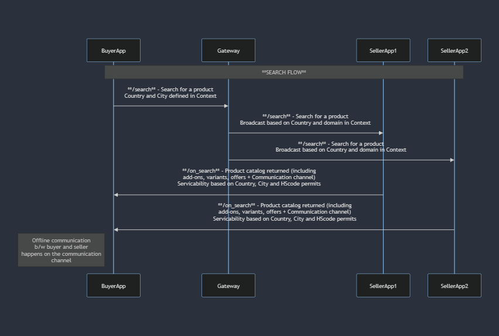
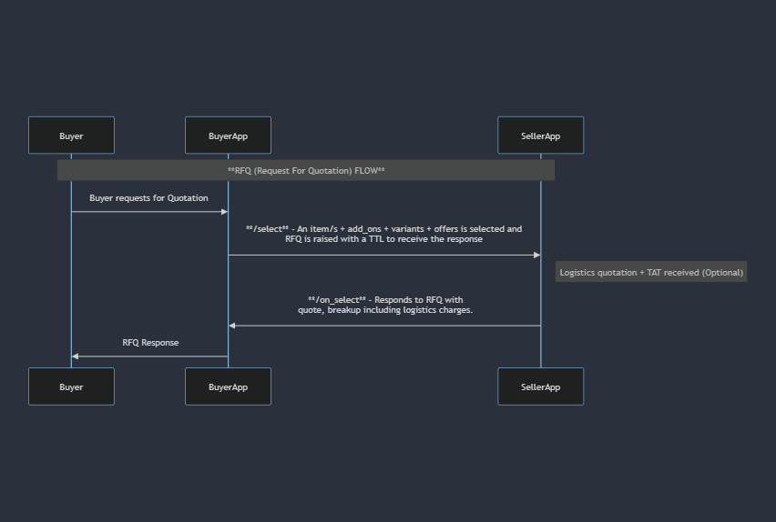
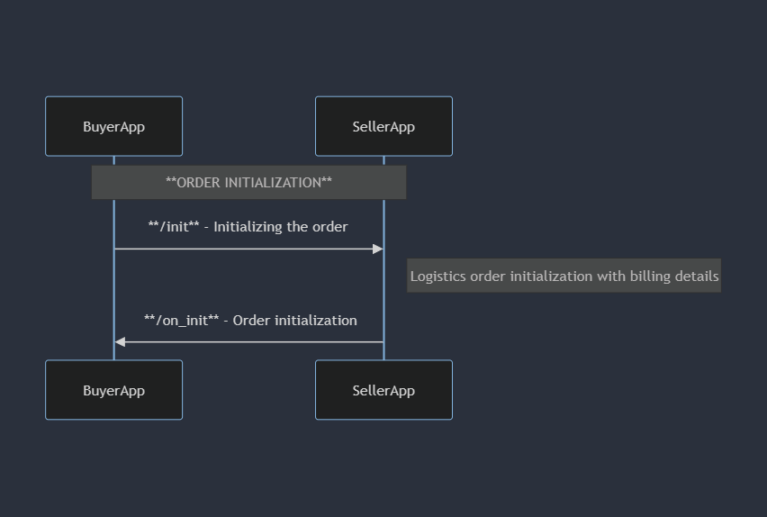
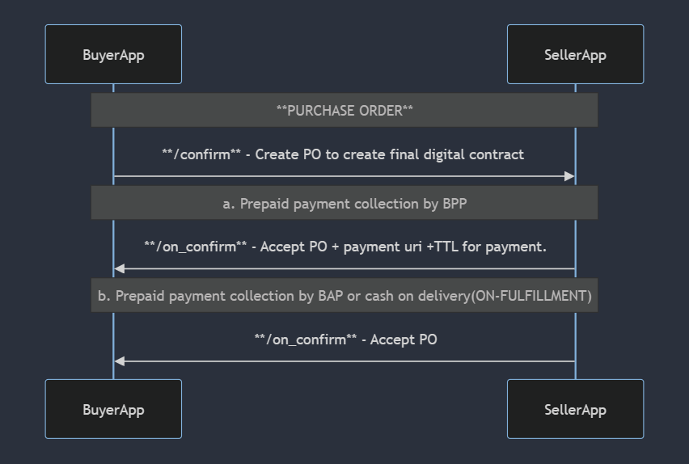
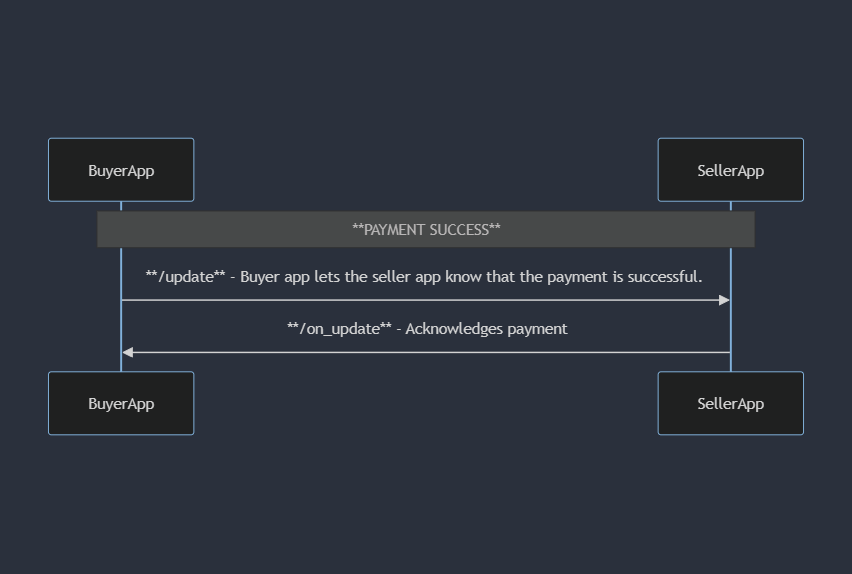
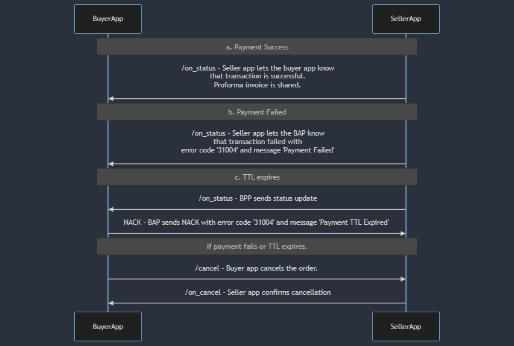
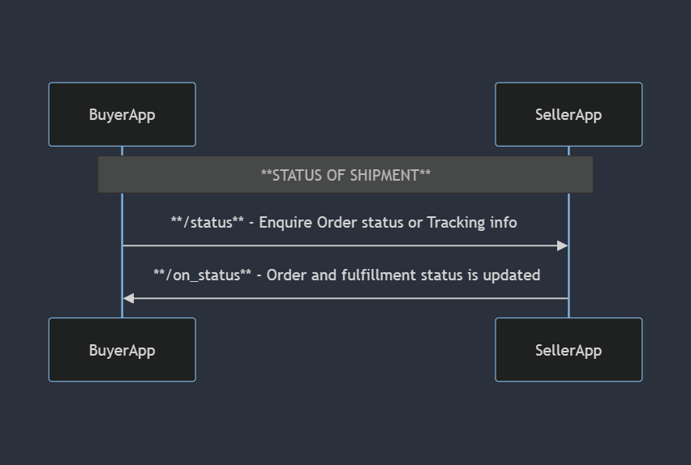

# B2B RFQ flow
The following is an illustrative flow to demonstrate a Request For Quotation(RFQ) flow.

## BUYER SEARCH & DISCOVERY
The buyer initiates the process by submitting a search request through the Buyer App (BAP). The Buyer Provider Platform (BPP) relays this request to the gateway, which broadcasts it based on country, domain, and city parameters. Seller apps respond with an on_search message directly to the buyer app. The on_search includes a product catalog with add-ons, variants, offers, and an optional communication channel for buyer-seller interactions. If the on_search lacks a chat link, the BAP can include it in the subsequent select request.

## RFQ (Request For Quotation) FLOW
After discussions between the buyer and seller through the communication channel, the buyer requests a quotation. The buyer app sends the RFQ via a select request to the seller app, including a Time-To-Live (TTL) for response receipt. The seller app responds with a quote, providing a detailed breakdown, including logistics charges.

## ORDER INITIALIZATION
Upon receiving the on_select from the seller app, the buyer app initiates the order by sending an init request, providing billing details and the precise delivery address. The seller app confirms this through an on_init call, initializing the order.

## PURCHASE ORDER
Next, the buyer app places the purchase order using a confirm request, creating a final digital contract. The Purchase Order (PO) is accepted by the BPP through an on_confirm request. In cases of prepaid payment collection by BPP, the on_confirm call includes a payment URI and a TTL for payment completion.

## PAYMENT COMMUNICATION for prepaid payment collected by BAP
In cases where the payment is collected by the Buyer App (BAP), once the payment is collected, an update request is sent to the BPP, signifying that the payment is complete. The BAP also provides a payment URI for the successful transaction. The BPP acknowledges this through an on_update request.

## PAYMENT COMMUNICATION for payment collected by BPP
For prepaid payment collected by BPP, the on_status request notifies the payment status. A successful payment status includes a transaction success message along with a proforma invoice. If the payment fails, the on_status message contains a "Payment Failed" notification with a 31004 error code. If the TTL expires, the BPP updates the BAP using on_status, and the BAP responds with a NACK, providing error code 31004 and the message 'Payment TTL Expired.' In case of payment failure or TTL expiration, the BAP can send a cancel request, acknowledged by the BPP using the on_cancel call. Refunds are initiated if the payment had already been made.

## REQUEST FOR ORDER STATUS  
This is an optional call where the BAP can inquire about the status of the transaction by sending a status request for order status or tracking information. The BPP responds with an on_status.

